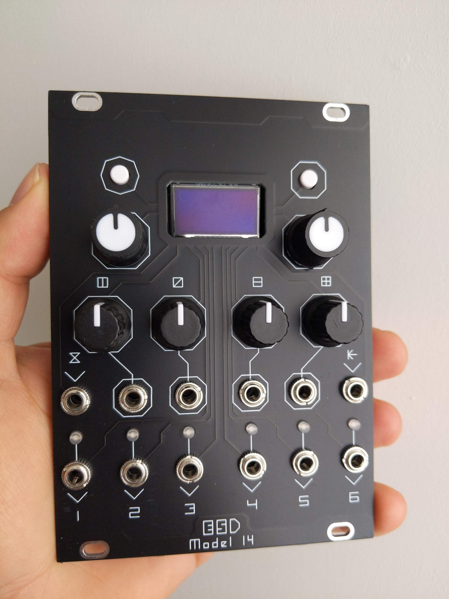

# E.S.D.
<!-- 
 _____ _____ ____  
|   __|   __|    \ 
|   __|__   |  |  |
|_____|_____|____/ 
 -->

Main repo for *ESD* Eurorack modules. 

- [*Model 14*](https://github.com/luisgongod/ESD_Modular/tree/main/model_14): an inspired _EuroPi_ module with 4 extra CVs, 4 Pots, 1 Digital Inpu, Bigger screen and I/O headers
- [*Model 15*](https://github.com/luisgongod/ESD_Modular/tree/main/model_15): Remix of the OG _EuroPi_ adding CV to the existing Pots and I/O headers for external modules

