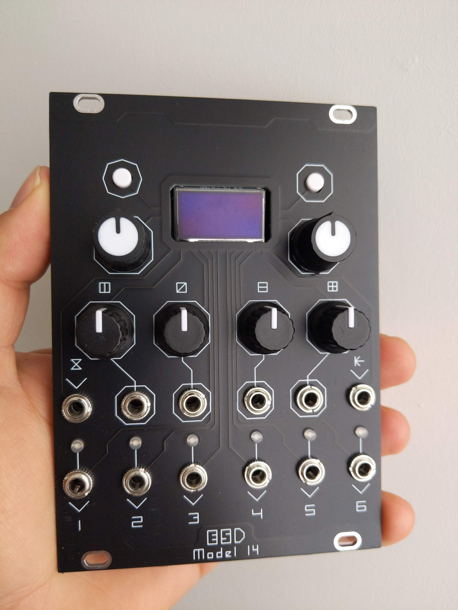
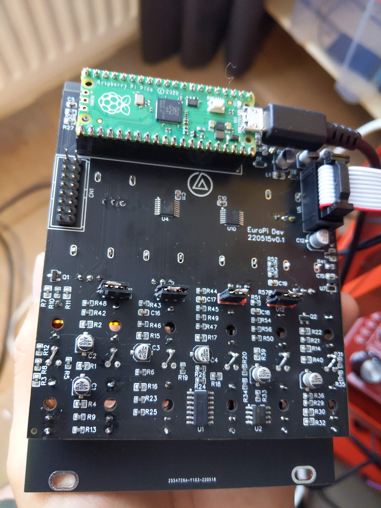

# Model 14

Programable Eurorack module inspired by Allen-Synthesis' [EuroPi](https://github.com/Allen-Synthesis/EuroPi).

## Description

Thid module is based on the schematics of the EuroPi, the main differences are:

- 7 extra Analogue inputs thanks to a multiplexer
- Larger 128x64 Oled display
- Extra digital input
- Access to un-used pins thru a header (for expansions)
- Jumper to change analog input from bipolar-unipolar or range (10Vpp or 5Vpp)

This module is fully compatible with all Europi [scripts](https://github.com/Allen-Synthesis/EuroPi/tree/main/software/contrib) using the midified firmware `europi_m14.py` (more details below).

## Get your own

Under `hardwared` you can find the gerbers and BOM files. _Caution_,  this last version of the hardware files was not produced, there was a small bug: the LEDs where not connected, you can see maybe that the ground needed to be wire in:

However I am confident that the module will work if manufactured as it is. Some assistant to debugging could be provided. Components are relatively easty to source and because of the nature of the I/O there is no need for high accuracy resistors (1% is ok). Calibrating the module is a most.

## Get Started

You can use the same setup as decribed in EuroPi's page ([here](https://github.com/Allen-Synthesis/EuroPi/blob/main/software/programming_instructions.md)). Once everything is installed, you can save the `europi_m14.py` file in the `libs` folder. You can also change the name and overwrite the `europi.py`, this will make all original scripts work right away. 
I have modified some of the scripts from the compilation to work with _model 14_. In this scripts I use the suffix `m14` to differenciate from originals. All credits to original authors should be in the code itself.

 
## To continue

This was an experiment to make my own definition/expanse of the Europi. I faced a few challenges but learn a lot. I want to focus on a different version. Perhaps if more people gets involved in increassing the scripts. 