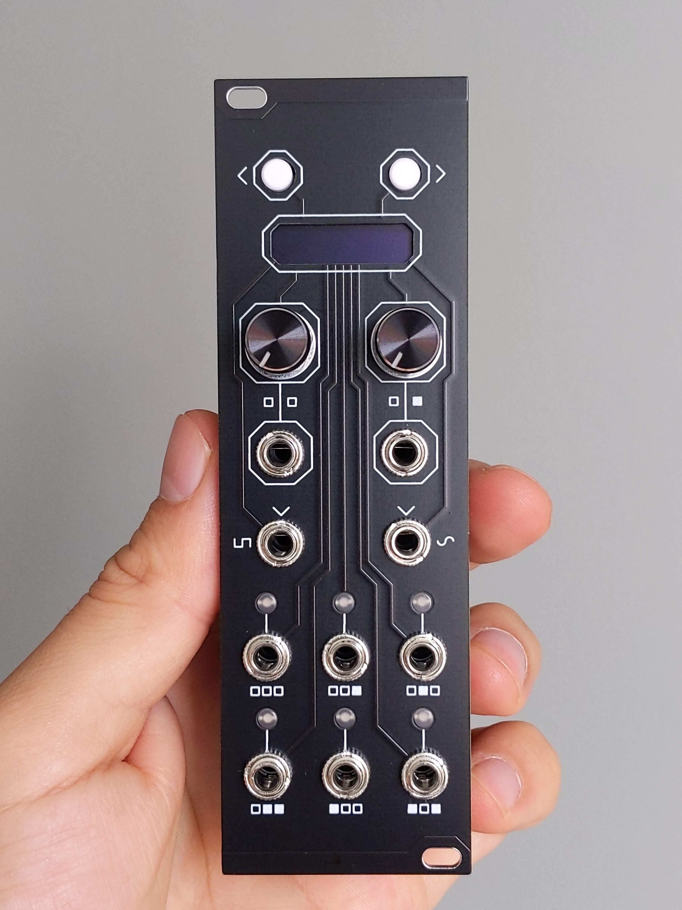
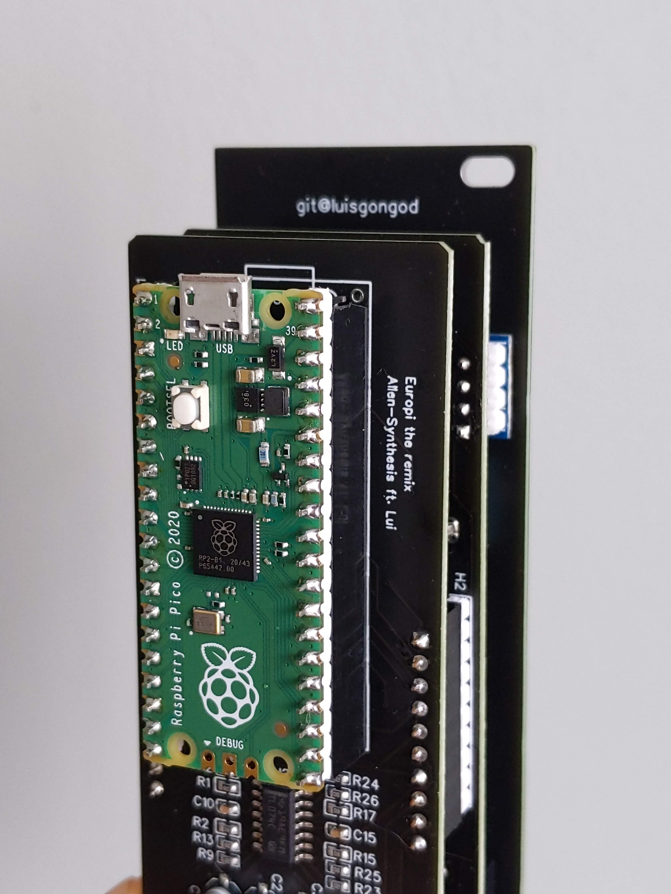

# Model 15

Programable Eurorack module Remix of by Allen-Synthesis' [EuroPi](https://github.com/Allen-Synthesis/EuroPi).

## Description

This module is based on the schematics of the EuroPi, the slight differences:

- Added CV to the Knobs (analogue input)
- Access to un-used pins thru a header (for expansions)
- Jumper to change analog input from bipolar-unipolar

This module is fully compatible with all Europi [scripts](https://github.com/Allen-Synthesis/EuroPi/tree/main/software/contrib) with original firmware. Bear in mind that if you opt for a bipolar input you may need to use the proper changes.

## Get your own

Under `hardwared` you can find the gerbers and BOM files. This gerber was done to be printed in one go, a v-cut is used to separate both pcnbs. Be careful about it when ordering.

## Get Started

You can use the same setup as decribed in EuroPi's page ([here](https://github.com/Allen-Synthesis/EuroPi/blob/main/software/programming_instructions.md)). 
 
 