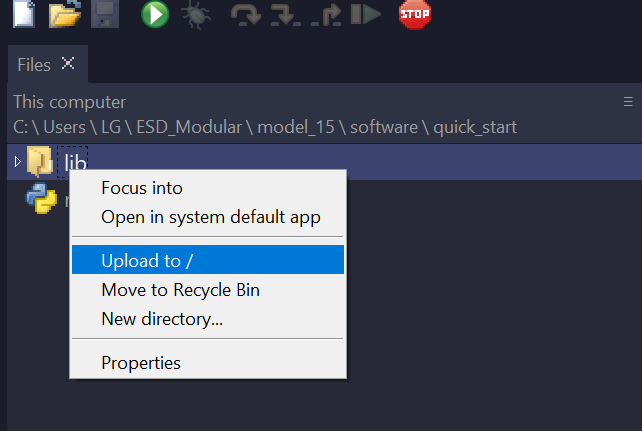

# Model 15

Programable Eurorack module Remix of by Allen-Synthesis' [EuroPi](https://github.com/Allen-Synthesis/EuroPi).


## Description

This module is based on the schematics of the EuroPi, the slight differences:

- Added CV to the Knobs.
- Access to un-used pins thru a header for expansions.
- Solder Jumper to change analog input from bipolar-unipolar* (Experimental! not tested)

In order for the m15 to work with latest Europi's [scripts](https://github.com/Allen-Synthesis/EuroPi/tree/main/software/contrib), custom Firmware `europi_m15.py` needs to be used. This is because following changes were made. 

- I2C1 is used for OLED, I2C0 is send to Expansion Header.
- Knobs pins are inverted. 
- Analog input is inverted so it can be used with bipolar signals. Therefore the calibration needs to be inverted as well

Explanation of this can be found in Custom Firmware section.


## Make your own

Under `hardwared` you can find the gerbers and BOM files. This gerber was done to be printed in one go, a v-cut is used to separate both pcnbs. Be careful about it when ordering. Exported files to `altium` are also included but _atention_ these were not verified (i dont have altium)


## Get Started

Recommended to use Adafruit's  [flash_nuke.uf2](https://learn.adafruit.com/getting-started-with-raspberry-pi-pico-circuitpython/circuitpython#flash-resetting-uf2-3083182) to clean your pico. Then, install the latest [micropython](https://micropython.org/download/rp2-pico/) for the Raspberry Pi Pico. Install the latest [Thonny](https://thonny.org/) IDE.
### Quick Start
Open Thonny and connect your Pico to your computer. On the top explorer navigate to the `\quick_start` folder right click to Upload the `/lib` folder and the `main.py` file to root of your Pico.
This should be enought to get you started with a few scripts that you can select from Menu. Press both buttons for 0,5s to get back to the menu.



You can also use the `ampy` tool to upload the files to the Pico. For example:
```
 C:\EuroPi-main\software> ampy  --port COM21 put contrib /lib/contrib
```
 
Other useful `ampy` commands can be found [here](https://learn.adafruit.com/micropython-basics-load-files-and-run-code/file-operations)

### Custom Firmware

The Europi repository has new scripts and improvements of the original firmware. These could work but I cant guarantee it. If you want to use the latest fw you can follow EuroPi's [instructions](https://github.com/Allen-Synthesis/EuroPi/blob/main/software/programming_instructions.md#setting-up) and then modify the `europi.py` and `calibrate.py`. 

- Using [Thonny](https://thonny.org/) install `micropython-ssd1306`, `micropython-europi` and `micropython-europi-contrib` latest packages.
- Copy the contents of `europi_m15.py` and paste in the `lib\europi.py` file.
- Copy the contents of `calibrate_m15.py` and paste in the `lib\calibrate.py` file.

If you use a single script, this setting would be enough to get it working. If you want to use the menu, you need to modify the `main.py` file. Unfortunatelly, I couldnt make this work, seems to be a bug with the USB VBUS present or the splashcreen. If you have any idea how to fix this, please let me know.

